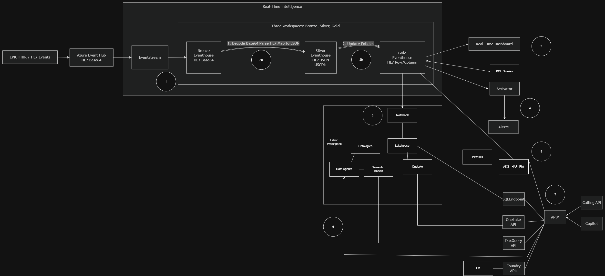

# Intermountain Health HIE Solution Architecture

Microsoft Fabric Real-Time Intelligence, Eventhouse, OneLake, semantic interoperability, and governed API access.

**Implemented FHIR access POC:** [HAPI FHIR over Gold Eventhouse](./docs/fhir-gold-poc.md)
documents the repurposed [Terraform deployment](./terraform), the containerized
read-only HAPI R4 adapter, Gold Eventstream ingestion, and five synthetic ePNA
lifecycle [Bundles and event files](./samples/epna). Gold remains authoritative;
no HAPI JPA, SQL, Cosmos or second clinical repository is introduced.

| Document information | Value |
|---|---|
| Architecture status | Approved architecture |
| Document type | Solution architecture document |
| Prepared for | Intermountain Health HIE |
| Prepared by | Chris Tava |
| Date | 4 October 2026 |

## Architecture Statement

This document establishes the illustrated architecture for the HIE proof-of-concept program. The implementation will ingest Epic FHIR/HL7 events through Azure Event Hubs and Fabric Eventstream, preserve raw HL7 Base64 in Bronze Eventhouse, perform Base64 decoding and HL7-to-JSON normalization inside Fabric, promote structured data through Silver and Gold Eventhouse layers, materialize analytical data into Lakehouse/OneLake, and expose governed real-time, analytical, semantic, alerting, FHIR, and API consumption paths.

## 1. Executive Summary

The architecture uses Microsoft Fabric Real-Time Intelligence as the primary real-time ingestion, transformation, persistence, and operational analytics platform for HIE events. Azure Event Hubs remains the external event ingress. Fabric Eventstream consumes the HL7 Base64 event stream and writes the original representation to Bronze Eventhouse. Fabric processing decodes Base64, parses HL7, and maps the data to HL7 JSON and a USCDI+ aligned Silver structure. Eventhouse update policies and governed transformation logic promote curated row-and-column structures into Gold Eventhouse.

The architecture separates operational real-time consumption from durable analytical and integration consumption. Gold Eventhouse directly supports KQL queries, Real-Time Dashboards, and Activator. A Fabric notebook materializes curated data into Lakehouse and OneLake for Power BI, semantic models, ontologies, data agents, and governed APIs. An AKS-hosted HAPI FHIR service provides a standards-based FHIR access path. Azure API Management provides the managed external access boundary for approved application, Copilot, and AI clients.

## 2. Architecture Approach

| Area | Approach |
|---|---|
| Ingress | Epic FHIR/HL7 events enter Azure Event Hubs as HL7 Base64 and are consumed by Fabric Eventstream. |
| Raw preservation | Bronze Eventhouse preserves the original HL7 Base64 event and operational metadata for traceability and replay. |
| Normalization | Base64 decoding, HL7 parsing, and mapping to JSON are performed inside Fabric. A second Event Hub for HL7 JSON is not part of the architecture. |
| Medallion organization | Separate Bronze, Silver, and Gold Fabric workspaces establish deployment, access, and lifecycle boundaries. |
| Real-time Gold | Gold is an Eventhouse/KQL row-and-column representation optimized for operational queries, dashboards, and event-driven detections. |
| Analytical landing | A governed notebook process writes selected Gold data to Fabric Lakehouse Delta tables in OneLake. |
| Semantic interoperability | Fabric ontologies and semantic models provide shared clinical and business meaning, while data agents provide governed natural-language access. |
| External access | API Management fronts the AKS-hosted HAPI FHIR service and approved SQL endpoint, OneLake API, DAX Query API, and Foundry-backed access patterns. |
| Alerting | Activator detects approved real-time conditions and invokes alerting workflows. It is not assumed to be the complete clinical subscription or durable delivery backbone. |

## 3. Logical Architecture



*Figure 1. HIE real-time intelligence and analytical architecture.*

| Source | Ingest | Bronze | Transform | Silver | Gold | Consumers |
|---|---|---|---|---|---|---|
| Epic FHIR/HL7 events | Azure Event Hubs and Fabric Eventstream | Eventhouse HL7 Base64 | Decode Base64, parse HL7, and map to JSON | Eventhouse HL7 JSON/USCDI+ | Eventhouse HL7 row/column | Dashboard, KQL, Activator, Lakehouse, Power BI, HAPI FHIR, APIs, and AI |

### 3.1 End-to-End Data Flow

1. Epic publishes FHIR/HL7 events to Azure Event Hubs using an HL7 Base64 payload and the agreed event envelope.
2. Fabric Eventstream consumes events once and delivers the unmodified payload and metadata to Bronze Eventhouse.
3. Fabric transformation logic decodes Base64, parses HL7 segments, validates the message, and maps the event to structured JSON.
4. Silver Eventhouse stores normalized HL7 JSON aligned to the approved USCDI+ profile and retains lineage to the Bronze event.
5. Eventhouse update policies and curated mappings populate Gold row-and-column tables intended for KQL and operational analytics.
6. Gold Eventhouse serves Real-Time Dashboards, KQL queries, and Activator-based detections.
7. A Fabric notebook incrementally materializes approved Gold entities into Lakehouse Delta tables and OneLake.
8. Power BI, semantic models, ontologies, data agents, and approved AI experiences consume governed Lakehouse/OneLake data.
9. The AKS-hosted HAPI FHIR service provides an approved FHIR R4 access path integrated with the curated Gold data boundary.
10. API Management exposes HAPI FHIR and other approved API products backed by appropriate data-access adapters rather than exposing the data stores directly.

## 4. Component Architecture

| Component | Role | Responsibility |
|---|---|---|
| Epic FHIR/HL7 events | Clinical source | Produces the source event and source identifiers. Message families and envelope are governed by an interface contract. |
| Azure Event Hubs | Ingress broker | Provides partitioned event ingress and decouples Epic from Fabric consumers. |
| Fabric Eventstream | Streaming ingestion | Consumes Event Hubs, routes events to Bronze, and provides the managed Fabric entry point. |
| Bronze Eventhouse | Raw persistence | Stores original Base64, envelope, timestamps, source, partition/offset, schema version, correlation identifiers, and processing status. |
| Transformation service | Decode and parse | Decodes Base64, parses HL7, validates required segments, emits normalized JSON, and quarantines invalid or unsupported events. |
| Silver Eventhouse | Normalized clinical event | Stores structured HL7 JSON/USCDI+ with traceability to Bronze and consistent event metadata. |
| Gold Eventhouse | Operational serving | Stores row-and-column entities for KQL, dashboarding, operational detection, and downstream materialization. |
| Real-Time Dashboard | Operational visualization | Uses KQL queries over Gold Eventhouse for current flow, quality, and clinical operations views. |
| Activator | Detection and action | Evaluates approved event and state conditions and triggers governed alerting or workflow actions. |
| Fabric Notebook | Materialization | Performs incremental Gold-to-Lakehouse processing, reconciliation, quality controls, and checkpointing. |
| Fabric Lakehouse/OneLake | Analytical storage | Hosts curated Delta tables and provides the governed analytical foundation. |
| Ontologies and semantic models | Semantic interoperability | Provide standardized meaning, measures, relationships, and terminology abstraction across consumers. |
| Data Agents | Natural-language data access | Provide governed question answering over approved semantic and data scopes. |
| Power BI | Business intelligence | Uses a semantic model over curated Fabric data. |
| Azure API Management | API boundary | Applies authentication, authorization, quotas, policies, observability, versioning, and product governance. |
| AKS-hosted HAPI FHIR | FHIR API service | Provides a governed FHIR R4 interface over approved clinical resources and remains behind API Management for external access. |
| SQL endpoint, OneLake API, and DAX Query API | Data access adapters | Provide fit-for-purpose read paths. APIM or an API service mediates access; clients do not receive direct broad data-store permissions. |
| Foundry APIs and language models | AI integration | Support approved AI or Copilot scenarios through governed tools and APIs rather than unrestricted data access. |

## 5. Data Architecture

### 5.1 Bronze

- Immutable or append-oriented retention of the received event and envelope.
- Capture event ID, correlation ID, message control ID where available, source, event time, ingestion time, partition, offset, schema version, payload hash, processing state, and regional metadata.
- Restrict access to platform operations, approved engineering, audit, and replay roles.
- Preserve original identifiers during replay and mark the replay attempt to support deduplication.

### 5.2 Silver

- Maintain one normalized JSON representation per supported message with explicit parse and validation status.
- Govern USCDI+ alignment through versioned mappings rather than inferring it at query time.
- Retain unrecognized fields where permitted so normalization does not silently discard source content.
- Link every Silver record to the Bronze event and transformation version.

### 5.3 Gold

- Eventhouse Gold is the operational serving layer, not a Fabric Warehouse in this architecture.
- Shape tables around approved use cases such as patient, encounter, observation, diagnosis, provider, facility, and event status.
- Use Gold KQL tables to feed real-time dashboards, KQL queries, Activator, and the notebook-based analytical materialization path.
- Use Lakehouse Gold/curated Delta tables as the analytical serving layer for Power BI, semantic models, data agents, and broader OneLake consumption.

## 6. Consumption and Data Egress

| Consumer | Technical path | Control point |
|---|---|---|
| Real-Time Dashboard | Direct KQL query against Gold Eventhouse | Fabric workspace permissions and KQL database/table policies |
| KQL users and operational tools | KQL query endpoint over Gold Eventhouse | Entra identity, database permissions, and query governance |
| Activator and alerts | Gold Eventhouse event/state detection to Activator to governed action | Activator rule ownership, approved action, audit, and rate controls |
| Power BI | Lakehouse/OneLake to semantic model to Power BI report | Semantic model RLS/OLS, sensitivity labels, and workspace/app permissions |
| Data Agents | Approved Lakehouse/semantic model scope to Fabric Data Agent | Agent instructions, source scope, identity propagation, and response audit |
| Calling applications | Client to APIM to HAPI FHIR or a constrained adapter for the SQL endpoint or OneLake-backed service | OAuth, APIM product/subscription, claims, resource/field-level authorization, and throttling |
| Copilot | Copilot/agent to APIM or governed agent tool to approved data service | Agent identity, least-privilege tool scope, user authorization, and logging |
| Foundry applications | Foundry tool or API to APIM to approved retrieval/query service | Managed identity, private access where required, and content and prompt controls |

Direct APIM-to-database arrows in the architecture are logical relationships. APIM does not itself execute arbitrary SQL, DAX, or OneLake queries. Each path requires a supported backend API or adapter that validates request semantics, applies authorization, executes constrained queries, shapes the response, and records audit telemetry. HAPI FHIR is an explicit API backend rather than a direct APIM-to-data-store connection.

## 7. Security, Privacy, and Compliance Architecture

- Use Microsoft Entra ID identities and managed identities for service-to-service access. Avoid embedded keys in notebooks, Eventstream configurations, APIs, and client applications.
- Apply least-privilege Fabric workspace, Eventhouse database/table, Lakehouse, semantic model, and API permissions.
- Separate Bronze, Silver, and Gold workspaces and deployment identities. Cross-workspace promotion occurs through approved pipelines or deployment processes.
- Encrypt data in transit and at rest using platform capabilities and organization-approved key-management requirements.
- Classify clinical data, minimize fields delivered to each consumer, and enforce consumer authorization at the semantic/API layer.
- Keep PHI out of operational logs where possible. Store identifiers, hashes, status codes, and correlation values sufficient for support and lineage.
- Validate private connectivity requirements for Event Hubs, Fabric, AKS/HAPI FHIR, API backends, Key Vault, Foundry, and consuming applications during implementation.
- Conduct threat modeling for ingestion spoofing, malformed HL7, replay abuse, over-broad KQL/SQL access, API enumeration, agent prompt injection, and unintended semantic-model disclosure.

## 8. Reliability, Resilience, and Operations

| Concern | Design requirement |
|---|---|
| Idempotency | Use stable event and message identifiers plus payload hashes; transformation and materialization jobs must tolerate replay. |
| Poison events | Quarantine invalid messages with sanitized diagnostic details and preserve the Bronze source event. |
| Checkpointing | Eventstream and notebook/materialization processes maintain independent checkpoints and observable lag. |
| Schema evolution | Version the event envelope, HL7 mappings, USCDI+ profile, KQL tables, Delta tables, semantic models, and APIs. |
| Reconciliation | Compare Bronze received, Silver valid/invalid, Gold promoted, and Lakehouse materialized counts by controlled windows. |
| Monitoring | Track ingestion lag, parse failures, update-policy failures, Gold freshness, notebook duration/failure, Activator actions, HAPI FHIR/API latency and errors, and model refresh. |
| Recovery | Document replay boundaries, materialization restart, rule rollback, semantic-model rollback, API version rollback, and operator ownership. |
| Regional resilience | Regional topology, failover authority, subscription/routing state, RTO/RPO, and duplicate behavior remain implementation choices requiring validation. |

## 9. Eight Proofs of Concept

| POC | Name | Primary outcome |
|---|---|---|
| POC 1 | Event Hub to Eventstream to Bronze Eventhouse | Prove secure ingestion, raw preservation, metadata capture, throughput, lag, and replay traceability. |
| POC 2 | HL7 Base64 to HL7 JSON and USCDI+ | Prove Base64 decoding, HL7 parsing, validation, error quarantine, Silver normalization, and Gold update policies. |
| POC 3 | Real-Time Dashboard | Prove KQL-backed operational visualization, freshness, filtering, and representative event/quality measures. |
| POC 4 | Activator alerts | Prove selected rules, action delivery, throttling behavior, auditability, and the boundary between operational alerts and clinical delivery. |
| POC 5 | Eventhouse to Lakehouse/OneLake | Prove incremental notebook materialization, Delta schema, checkpointing, reconciliation, and analytical query readiness. |
| POC 6 | Semantic interoperability and data agents | Prove ontologies, semantic models, approved terminology mapping, natural-language questions, identity, and result traceability. |
| POC 7 | Governed API access through APIM | Compare SQL endpoint-backed, OneLake-backed, DAX Query, and Foundry API patterns through a constrained backend service and APIM. |
| POC 8 | AKS-hosted HAPI FHIR | Prove a governed FHIR R4 service path for approved Gold clinical resources through HAPI FHIR, AKS, and APIM. |

## 10. Cross-POC Acceptance Criteria

- **Functional:** Supported events complete the full Bronze-to-Silver-to-Gold path and retain lineage.
- **Performance:** Measured throughput, event size, burst, transformation latency, dashboard freshness, materialization latency, and API response times are recorded against agreed targets.
- **Quality:** Mapping completeness, parse failures, data-quality exceptions, duplicates, and reconciliation results are visible.
- **Security:** Unauthorized identities, fields, queries, API routes, and agent sources are rejected and audited.
- **Reliability:** Replay, duplicate delivery, malformed payload, dependency outage, throttling, checkpoint restart, and partial failure scenarios are exercised.
- **Operations:** Dashboards and runbooks identify owners, alerts, diagnostic queries, recovery steps, and escalation paths.
- **Outcome:** Each POC ends with a documented pass, conditional pass, or fail and records any architecture change required.

## 11. Implementation Workstreams

| Workstream | Key outputs |
|---|---|
| Platform foundation | Fabric capacities/workspaces, Eventhouse databases, Lakehouse, deployment environments, network, and identity design |
| Data contract | Event envelope, supported HL7 message families, required metadata, schema versioning, USCDI+ mapping, and quality rules |
| Streaming and transformation | Event Hub integration, Eventstream, Bronze tables, decoder/parser, Silver tables, update policies, and Gold tables |
| Operational experience | KQL query library, Real-Time Dashboard, Activator rules, action governance, and support dashboards |
| Analytical and semantic | Notebook materialization, Delta tables, semantic model, ontology, Power BI, and data agent |
| Integration and AI | AKS-hosted HAPI FHIR, backend API adapters, APIM products/policies, Copilot/Foundry tools, identity propagation, and audit |
| Security and operations | Threat model, access matrix, monitoring, reconciliation, replay, disaster recovery, runbooks, and ownership |

## 12. Assumptions, Constraints, and Open Implementation Topics

- The architecture diagram and the approaches in this document are authoritative for the eight-POC program unless changed through architecture governance.
- Gold Eventhouse and analytical Lakehouse are intentionally distinct serving models. The term "Gold" must always be qualified as operational Eventhouse Gold or analytical Lakehouse Gold.
- The specific HL7 parser implementation, supported HL7 versions/message families, and USCDI+ mapping profile will be selected and versioned during POC 2.
- Capacity sizing requires measured event rate, peak/burst factor, payload size, retention, query concurrency, notebook workload, semantic-model size, and API demand.
- The diagram does not establish a production clinical Pub/Sub contract. Dynamic subscriptions, durable endpoint delivery, retries, DLQ, and region recovery require a separate architecture review if included in production scope.
- RTO, RPO, data residency, retention, private networking, customer-managed key requirements, and regulated-data controls must be confirmed with the responsible Intermountain governance teams.

## 13. Architecture Governance

Any proposed change to ingress, Bronze/Silver/Gold boundaries, transformation location, Eventhouse-to-Lakehouse materialization, semantic access, API exposure, or identity model must be recorded in an architecture record. The change must identify the affected POCs, security and privacy impact, migration impact, rollback approach, and diagram/document updates before implementation.

## Appendix A. Architecture Traceability

| Architecture element | Rationale |
|---|---|
| Single Event Hub input | Avoids a duplicate normalized Event Hub when decoding and normalization can be evaluated inside the Fabric processing path. |
| Eventhouse Bronze/Silver/Gold | Keeps real-time ingestion, KQL transformation, operational query, and dashboard functionality in the Real-Time Intelligence plane. |
| Lakehouse/OneLake analytical branch | Provides durable Delta-based analytical consumption and a foundation for Power BI and semantic interoperability. |
| Separate semantic layer | Prevents each consumer from independently interpreting clinical fields and relationships. |
| APIM boundary | Centralizes API authentication, policy, throttling, versioning, and observability while backend adapters constrain data access. |
| Eight POCs | Reduces architecture risk by validating each major boundary independently and then as an end-to-end path. |

## Appendix B. Source and Architecture Basis

This document is based on the HIE solution architecture diagram and the prior Intermountain HIE event-handling analysis. The prior analysis identified the need to preserve raw HL7 Base64, maintain a Fabric medallion/real-time analytics path, separate persistence from notification, and validate security, replay, latency, failure handling, and regional recovery. This document supersedes the prior discussion posture only for the specific architecture components and eight POCs expressly established here. Production clinical notification routing remains outside the approved scope unless separately authorized.

## POC 4 Implementation: ePNA Activator Alert

The proof-of-concept deployment is in [`infra/`](./infra). Bicep remains the deployment entry point. Fabric **capacity** is a native Azure Resource Manager resource; optionally provision a paid F2 with [`infra/capacity.bicep`](./infra/capacity.bicep). Because Fabric workspaces, Eventhouses, KQL databases, and Activator items are Fabric SaaS resources rather than Azure Resource Manager resources, the Bicep deployment script uses a pre-authorized managed identity to call the supported Fabric REST APIs.

The deployment creates or reconciles:

1. A Gold Fabric workspace assigned to an existing Fabric capacity.
2. A Gold Eventhouse and read/write KQL database.
3. The KQL schema in [`fabric/kql/DatabaseSchema.kql`](./fabric/kql/DatabaseSchema.kql).
4. An Activator/Reflex item that polls `EpnaAlertCandidates()` every 60 seconds.
5. An email rule that fires when an active emergency encounter transitions to a clinician-approved ePNA-qualified signal.

The deployment also creates a custom-endpoint Gold FHIR Eventstream using the
[direct-ingestion definition](./fabric/eventstream/GoldFhirEventstream.template.json).
It writes one resource or monitoring envelope per event into `GoldFhirEvent`;
transactional update policies populate the canonical and typed Gold tables.
Invalid envelopes are visible in `GoldFhirRejectedEvent`. See the
[FHIR/ePNA runbook](./docs/fhir-gold-poc.md) for publishing and acceptance checks.
The alert query now selects the latest encounter signal **before** applying
eligibility filters, so an older qualified signal cannot supersede discharge,
transfer or non-qualification.

### Standards boundary

FHIR does not have a "FHIR v2" release. This POC preserves source **HL7 v2** message version and provenance, then represents Gold clinical entities as **FHIR R4 (4.0.1)** resources using versioned US Core profile canonicals and explicit USCDI/USCDI+ mapping metadata. USCDI+ is a program with domain datasets, not a single FHIR profile. `MappingVersion`, `UscdiVersion`, `UscdiPlusDomain`, and `TerminologyVersion` therefore remain explicit and governed rather than being inferred.

The generic `GoldFhirResource` table retains the canonical FHIR JSON and lineage. Typed Patient, Encounter, Condition, Observation, ServiceRequest, DiagnosticReport, and Provenance projections provide stable row-and-column entities for POC 6 ontologies, semantic models, and data agents. Terminology-bearing fields always store both system and code; production mappings must bind approved SNOMED CT, LOINC, RxNorm, ICD-10-CM, and local-code translations through the governed terminology service.

### Alert safety boundary

The POC does not diagnose pneumonia and does not invent clinical scoring thresholds. `EpnaAlertCandidates()` only returns an alert when an upstream, versioned qualification policy has emitted all of the following:

- `AlertEligible == true`
- `MonitoringStatus == "qualified"`
- `EncounterStatus == "in-progress"`
- `EncounterClassCode == "EMER"`

The email excludes direct patient identifiers. Activator demonstrates operational detection and action delivery only; it is not the durable clinical subscription, escalation, acknowledgement, or guaranteed-delivery system.

### Prerequisites

- An existing Fabric capacity and its Fabric capacity UUID, or a paid capacity provisioned with the optional deployment below.
- A user-assigned managed identity enabled in the Fabric tenant setting for service principals.
- Permission for that identity to create workspaces and assign them to the selected capacity.
- The identity must become Workspace Admin/Contributor through the workspace-creation flow so it can create items.
- An Azure principal permitted to deploy `Microsoft.Resources/deploymentScripts` with that identity.

Copy [`infra/main.example.bicepparam`](./infra/main.example.bicepparam) to `infra/main.bicepparam`, replace the placeholders, and deploy:

```powershell
az deployment group create `
  --resource-group <resource-group> `
  --template-file .\infra\main.bicep `
  --parameters .\infra\main.bicepparam
```

`enableActivatorRule` defaults to `false`. Load the synthetic row from [`fabric/kql/SampleData.kql`](./fabric/kql/SampleData.kql), validate the query and notification ownership, then redeploy with the rule enabled. Never put production identifiers in the sample file or non-production workspace.

### Optional paid F2 capacity

[`infra/capacity.bicep`](./infra/capacity.bicep) deploys `Microsoft.Fabric/capacities@2023-11-01` and defaults to **F2 (2 capacity units)**. Capacity creation is deliberately separate from [`infra/main.bicep`](./infra/main.bicep): the existing trial deployment remains unchanged, and creating a paid resource requires an explicit deployment. The capacity template does not create workspaces, a managed identity, tenant permissions, or alerts.

Prerequisites:

- An Azure subscription in the **same Microsoft Entra tenant** as the target Fabric environment, with permission to create Fabric capacities and resource-group deployments.
- The `Microsoft.Fabric` resource provider registered in that subscription.
- A supported region and at least 2 available capacity units of quota for F2. The example uses `westcentralus`; verify regional support and data-residency requirements before deployment.
- At least one approved **tenant-member user's UPN** for the capacity administrator. B2B guest users cannot be capacity administrators.
- An approved budget: paid capacity starts incurring charges when provisioned. F2 is a small synthetic-POC starting point, not a sizing recommendation for production HIE traffic.

Copy [`infra/capacity.example.bicepparam`](./infra/capacity.example.bicepparam) to [`infra/capacity.bicepparam`](./infra/capacity.bicepparam), which is excluded from Git. Review the capacity name, region, and SKU, then set the administrator UPN in the same shell:

```powershell
Copy-Item .\infra\capacity.example.bicepparam .\infra\capacity.bicepparam
$env:FABRIC_CAPACITY_ADMIN_UPN = '<tenant-member-admin-upn>'

# Review proposed Azure resource changes without creating the capacity.
az deployment group what-if `
  --resource-group <resource-group> `
  --template-file .\infra\capacity.bicep `
  --parameters .\infra\capacity.bicepparam

# Run only after approving the region, administrator, and paid-capacity cost.
az deployment group create `
  --name hie-fabric-capacity `
  --resource-group <resource-group> `
  --template-file .\infra\capacity.bicep `
  --parameters .\infra\capacity.bicepparam
```

After provisioning:

1. Confirm the capacity is active in Fabric. The template's `capacityResourceId` output is an **Azure resource path**, not the Fabric capacity UUID.
2. Obtain the new **Fabric capacity UUID** from the Fabric admin portal, or the `id` returned by `GET https://api.fabric.microsoft.com/v1/capacities` as an authorized user. Follow API pagination and verify the capacity name, region, SKU, and state; do not take an arbitrary first result.
3. Have the capacity administrator grant the deployment identity the required Fabric capacity assignment rights, and confirm its tenant permissions. Azure RBAC and the capacity's human-admin list do not automatically authorize the managed identity in Fabric.
4. Replace `fabricCapacityId` in your local [`infra/main.bicepparam`](./infra/main.bicepparam) with the new UUID. Keep the existing managed-identity and recipient requirements and `enableActivatorRule = false`.
5. Use a distinct `workspaceDisplayName`, such as `hie-gold-f2-poc`, or explicitly reassign the existing Gold workspace to the new capacity in Fabric first. The deployment rejects an existing workspace on a different capacity rather than silently keeping it on the trial; it does not perform a migration.
6. Run the existing Gold workspace deployment command above and complete the synthetic POC acceptance checks.

**Cost control:** pause the paid capacity in the Azure portal when the POC is not in use, and resume it before testing. Pausing can make the assigned content unavailable, so do not expect continuous Activator monitoring while paused. Remaining smoothed usage/overages can be billed on pause, and storage and other Azure services have separate charges. Review current regional pricing rather than treating F2 or pause/resume as free.

**POC 6:** Microsoft's data-agent prerequisites include a **paid F2 or higher** capacity. F2 removes the trial-capacity limitation, but does not automatically enable or deploy a data agent. Tenant AI settings, regional/cross-geo policy, source access, and clinical governance still require review; this deployment does not change them.

References: [native Bicep capacity resource](https://learn.microsoft.com/en-us/azure/templates/microsoft.fabric/2023-11-01/capacities), [capacity provisioning prerequisites](https://learn.microsoft.com/en-us/fabric/enterprise/buy-capacity), [Fabric capacity UUID API](https://learn.microsoft.com/en-us/rest/api/fabric/core/capacities/list-capacities), [pause and resume](https://learn.microsoft.com/en-us/fabric/enterprise/pause-resume), and [data-agent prerequisites](https://learn.microsoft.com/en-us/fabric/data-science/concept-data-agent).

### Trial capacity: POC 4 only

An existing Fabric trial capacity can be used for the real-time analytics POC, subject to its current status, tenant settings, and the deployment identity's permissions. Use the trial's **capacity UUID**, not an Azure resource ID. The deployment targets a dedicated `hie-gold-poc` workspace; it does not modify the personal **My workspace** shown in the portal.

The environment-specific [`infra/main.bicepparam`](./infra/main.bicepparam) is excluded from Git. The local trial configuration contains the selected capacity UUID and keeps the Activator rule disabled. It reads the remaining deployment values from environment variables so missing values stop parameter compilation rather than deploying placeholder identities or recipients:

```powershell
$env:FABRIC_DEPLOYMENT_IDENTITY_RESOURCE_ID = '/subscriptions/<subscription-id>/resourceGroups/<identity-resource-group>/providers/Microsoft.ManagedIdentity/userAssignedIdentities/<identity-name>'
$env:EPNA_ALERT_RECIPIENT = '<approved-poc-recipient>'
```

Set real values in the same shell used to run the deployment command above. The deployment still needs an Azure resource group and permission to use that managed identity. Fabric trial capacity does not provide those Azure resources, and the deployment script's supporting Azure resources can incur charges even though the Fabric capacity is a trial.

Before deployment:

- If the portal reports **"Your capacity admin is unavailable"**, ask a Fabric tenant administrator to reassign the capacity admin and verify assignment rights. Access to an existing workspace does not prove permission to assign a new workspace to that capacity.
- Confirm that the managed identity has the required Fabric tenant permissions and capacity Contributor/Admin access. Creating a user-assigned identity or granting Azure RBAC alone does not grant Fabric permissions.
- Confirm the trial's remaining lifetime in **OneLake catalog > Govern > Capacities**; preserve synthetic test evidence and plan capacity reassignment before expiry.
- Use synthetic data only. Trial limitations include unavailable Private Link and some other enterprise controls; a trial is not a production clinical environment.

**POC 6 data-agent deployment is deferred.** Microsoft documents that Fabric trial capacities do not support Fabric data agents. Retain the versioned clinical entities and provenance for later semantic work, then move to a supported paid capacity and validate the relevant tenant and regional prerequisites before deploying the data agent. No ontology, semantic model, or data agent is provisioned by this POC.

References: [Fabric trial capabilities and expiry](https://learn.microsoft.com/en-us/fabric/fundamentals/fabric-trial), [features by capacity](https://learn.microsoft.com/en-us/fabric/enterprise/fabric-features), and [workspace creation permissions](https://learn.microsoft.com/en-us/rest/api/fabric/core/workspaces/create-workspace).

### POC acceptance checks

1. Run `EpnaAlertCandidates()` before ingestion and confirm it returns no rows.
2. Ingest the synthetic sample with a current `EventTime`; update the included timestamp if needed.
3. Confirm exactly one candidate is returned for the synthetic encounter.
4. Enable the rule and confirm one email is delivered without a patient identifier.
5. Replay the same signal and verify the `BecomesGreaterThan` state transition suppresses a duplicate action.
6. Insert a non-qualified, non-emergency, ended, or `AlertEligible=false` signal and verify no action occurs.
7. Capture Activator run history, delivery latency, throttling behavior, ownership, and audit evidence.
